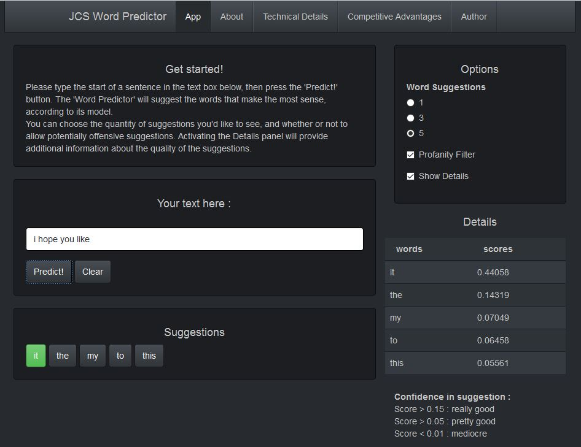

JCS WORD PREDICTOR
========================================================
transition: rotate

 
App : [Predicting your next words](http://jcohensolal.shinyapps.io/JCSWordPredictor)
  
Date : April 2016  
 
Author : Julien COHEN SOLAL
* Blog : [http://jcohensolal.blogspot.com](http://jcohensolal.blogspot.com)
* Github : [https://github.com/juliencohensolal](https://github.com/juliencohensolal)
  

<small>
Originally implemented as the Capstone Project of the Data Science Specialization of Johns Hopkins University, using state-of-the-art Natural Language Processing techniques.
</small>

Presenting the App
========================================================
type: section
<small>

* High-quality word suggestions 
    * High score (22% top 3 precision) on independent prediction benchmark ([DSCI Benchmark](https://github.com/jan-san/dsci-benchmark))  
* Lightweight app
    * Fast suggestions 
    * Low memory footprint
* Highly modulable
    * Choice of 1, 3 or 5 ordered suggestions
    * Safe mode available to remove profanities in suggestions
    * Optional Details panel for information about suggestions quality
* User-friendly graphical interface
    * Bootstrap look-and-feel
    * Suggestions shown as buttons for quick sentence completion
    
</small>

User Instructions
========================================================
type: section
left: 60%

***
<small>

1. Choose the number of suggestions you want on top-right. Uncheck the *Profanity Filter* if you want to. 
  
2. In the text box, enter a succession of words (which makes sense, if you hope for word suggestions that make sense!)  
  
3. Hit *Predict!* button. Suggestions appear underneath.  
  
4. If you want details about the suggestions, check  *Show Details*.
  
5. Hit the word you want and launch another prediction!

</small>

Technical Details
========================================================
type: section

The Corpus

<small>
[HC Corpora](http://www.corpora.heliohost.org/aboutcorpus.html) : sentences collected from publicly available sources (news, blogs & Twitter) by a web crawler. Consists of more than 100M words.  
</small>
  

Data Preprocessing

<small>
Astute removal of all non-UTF-8 characters, URLs, email adresses, numbers, most punctuation, excessive white space between words. Correction of common word contractions and misspells
</small>
  

Dictionaries Creation

<small>
Storing *n-grams* : contiguous sequences of *n* words (1 to 4 words). Each n-gram is linked to the frequency at which it was observed in the training data. 
To allow for quick, yet efficient word suggestions, the focus was on making the dictionaries as small as possible on disk, and also quick to access, while not losing too much information. Encoding the words as integers helped a lot in that aspect, as did the removal of low-frequency 2+ grams, since the bigger your training data is, the more probable it is that 2+ grams appearing just once or twice include in fact misspelled words, and as such don't provide quality information.
</small>
  

Technical Details - cont.
========================================================
type: section
The Algorithm

<small>
Using only high-count grams (3+) has the advantage of conditioning on a lot of context, so given sufficient training data the n-grams counts will converge to the *true value*. Drawback is that many counts will be equal to zero, so we need a huge sample to get a good estimate. This is a low bias, high variance approach.
  
Using only low-count grams (1 or 2) ignores context, and as such will converge to an estimator that won't be as good. It has high bias, but will converge relatively quickly. It doesn't need as big a sample.
  
The **Linear MLE Interpolation** takes the best of both worlds, using counts from all n-grams sizes it has at its disposal, and weighing these counts (the higher the gram, the bigger the weight is, and weights must sum to 1). The value of these weights can be optimized in order to maxmize the predictive power of the model, by testing on a subset of the corpus that wasn't used for training.
  
For this app, time lacked for weight optimization. Various combinations were tested, the following values were chosen : 0.55 for 4-grams, 0.35 for 3-grams, 0.099 for 2-grams and 0.001 for 1-grams</small>

